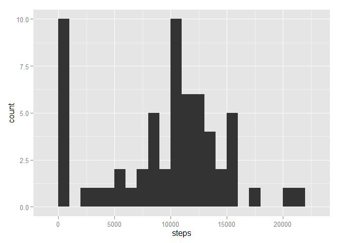
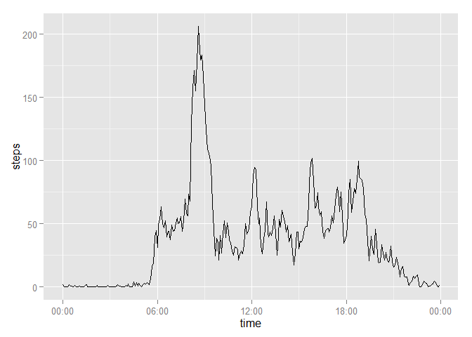
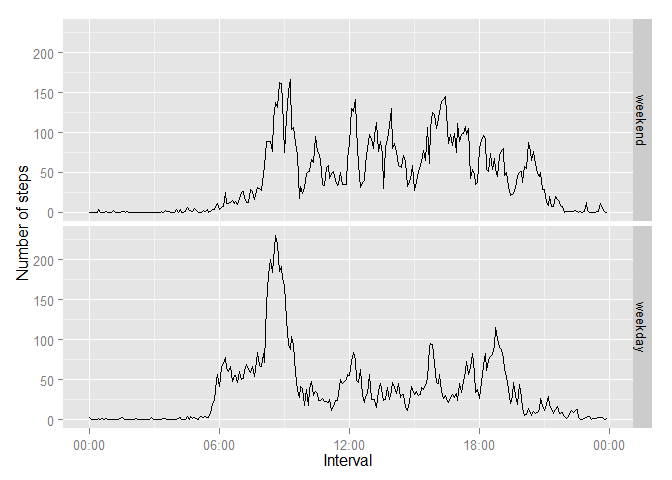

# Reproducible Research: Peer Assessment 1

### Loading and preprocessing the data

First we will read in the data using the read.csv() function


```r
activity <- read.csv("activity.csv", header = TRUE, colClasses = c("numeric", "Date", "numeric"))
```

A brief summary of the columns


```r
str(activity)
```

```
## 'data.frame':	17568 obs. of  3 variables:
##  $ steps   : num  NA NA NA NA NA NA NA NA NA NA ...
##  $ date    : Date, format: "2012-10-01" "2012-10-01" ...
##  $ interval: num  0 5 10 15 20 25 30 35 40 45 ...
```

### What is mean total number of steps taken per day?

Use the aggregate() function to calculate the number of steps taken each day


```r
totalStepsPerDay <- aggregate(activity$steps, by = list(activity$date), FUN = function(p) sum(p, na.rm = TRUE))
colnames(totalStepsPerDay) <- c("date", "steps")
```

Plot histogram of the total number of steps for each day using the ggplot2 package


```r
library(ggplot2)
qplot(steps, data = totalStepsPerDay, binwidth = 1000)
```

 

Mean of daily steps


```r
mean(totalStepsPerDay$steps)
```

```
## [1] 9354.23
```

Median of daily steps


```r
median(totalStepsPerDay$steps)
```

```
## [1] 10395
```

### What is the average daily activity pattern?

We will again use the aggregate() function to calculate the average steps taken for each interval


```r
averageStepsPerInterval <- aggregate(activity$steps, by = list(activity$interval), 
                                     FUN = function(p) mean(p, na.rm = TRUE))
colnames(averageStepsPerInterval) <- c("interval", "steps")
```

Creating a new column for conversion of the interval data to proper time


```r
time <- formatC(averageStepsPerInterval$interval, width = 4, flag = "0", format = "d")
time <- strptime(time, format = "%H%M")
averageStepsPerInterval <- cbind(averageStepsPerInterval, time)
```

Plot time series graph for the daily pattern


```r
ggplot(data = averageStepsPerInterval, aes(time, steps)) + geom_line() +
    scale_x_datetime(labels = c("00:00", "06:00", "12:00", "18:00", "00:00"))
```

 

The time interval containing the maximum number of steps on average


```r
strftime(averageStepsPerInterval[which.max(averageStepsPerInterval$steps), 3], format = "%H:%M")
```

```
## [1] "08:35"
```

### Imputing missing values

Replace the missing values with the mean of its 5 minute interval 

Create a copy of the data and apply the replacement to each row containing NA


```r
activity_nona = activity
newsteps <- apply(activity[, -2], 1, function(x) {
    if (is.na(x[1])){
        x[1] <- averageStepsPerInterval[which(x[2] == averageStepsPerInterval$interval), 2]
    }
    x[1]
})
activity_nona$steps <- newsteps
```

Use the aggregate() function to calculate the number of steps taken each day


```r
totalStepsPerDay <- aggregate(activity_nona$steps, by = list(activity_nona$date), FUN = sum)
colnames(totalStepsPerDay) <- c("date", "steps")
```

Plot histogram of the total number of steps for each day using the ggplot2 package


```r
library(ggplot2)
qplot(steps, data = totalStepsPerDay, binwidth = 1000)
```

 

Mean of daily steps


```r
mean(totalStepsPerDay$steps)
```

```
## [1] 10766.19
```

Median of daily steps


```r
median(totalStepsPerDay$steps)
```

```
## [1] 10766.19
```

After imputing the missing values, the histogram no longer has a large count at zero, and appear more Gaussian.

The mean and median both increases, since NA was treated as zero before.

### Are there differences in activity patterns between weekdays and weekends?

Create factor indicating whether a day is a weekday or during the weekend


```r
week <- weekdays(activity_nona$date)
week <- week == "Sunday" | week == "Saturday"
week <- factor(week, levels = c("TRUE", "FALSE"), labels = c("weekend", "weekday"))
activity_nona <- cbind(activity_nona, week)
```

Use the aggregate() function to calculate the average steps taken for each interval for weekday and weekend


```r
averageStepsPerInterval <- aggregate(activity_nona$steps, 
                    by = list(activity_nona$interval, activity_nona$week), FUN = mean)
colnames(averageStepsPerInterval) <- c("interval", "week", "steps")
```

Creating a new column for conversion of the interval data to proper time


```r
time <- formatC(averageStepsPerInterval$interval, width = 4, flag = "0", format = "d")
time <- strptime(time, format = "%H%M")
averageStepsPerInterval <- cbind(averageStepsPerInterval, time)
```

Plot time series graph for the daily pattern faceted for weekday and weekend


```r
ggplot(data = averageStepsPerInterval, aes(time, steps)) + geom_line() +
    scale_x_datetime(labels = c("00:00", "06:00", "12:00", "18:00", "00:00")) +
    facet_grid(week~.) + xlab("Interval") + ylab("Number of steps")
```

 
